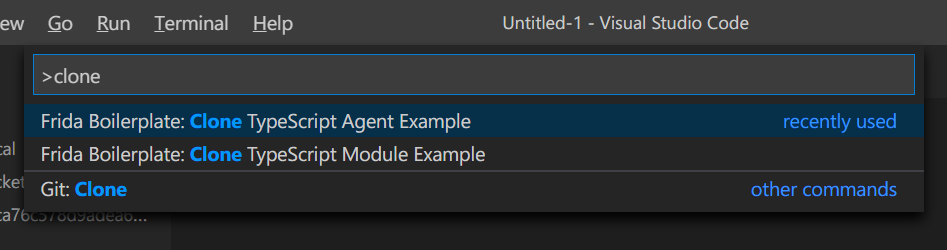
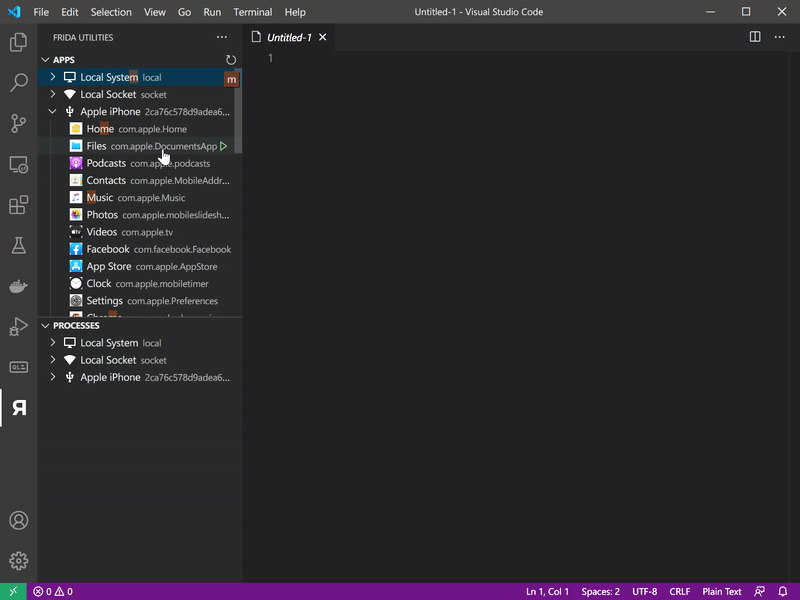
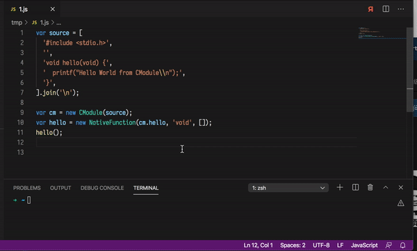
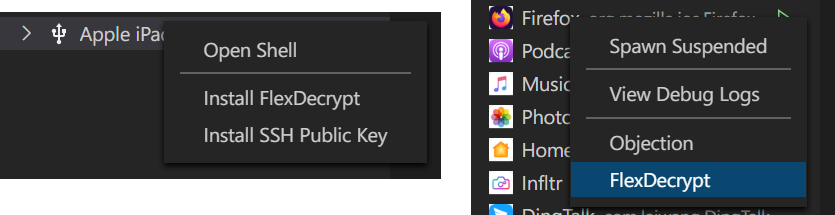

# vscode-frida

**Unofficial** frida workbench for VSCode

[Get it on Marketplace](https://marketplace.visualstudio.com/items?itemName=CodeColorist.vscode-frida)

## Prerequisites

* Python3
* `pip3 install -U frida-tools`
* [iproxy](https://libimobiledevice.org/#get-started) * (For Windows build, see https://github.com/libimobiledevice-win32/imobiledevice-net/releases)
* SSH client (`ssh` command) *
* iTunes on Windows

[*] Optional. Only some of the functionalities rely on it

FlexDecrypt depends on SSH. You need to generate a public key before using it.

## Features

### Target Selector

User friendly UI

### Clone Boilerplate

[@oleavr](https://github.com/oleavr) has made two boilerplates so you can code in TypeScript!

* Frida Boilerplate: Clone TypeScript Agent Example
* Frida Boilerplate: Clone TypeScript Module Example

### Debug Log

Now supports both iOS syslog and Android logcat!

### Download and Apply frida-gum Typing Info

### Objection

* [Objection](https://github.com/sensepost/objection) Runtime Mobile Exploration

### Javascript REPL shortcut

Open and activate an REPL at the bottom. Use the "frida" button at the top of any active `js` / `typescript` document, it will send the code to the active REPL.

### FlexDecrypt

[FlexDecrypt](https://github.com/JohnCoates/flexdecrypt) seems to be the best app decryptor so far. It almost act like a static decryptor, without running the actual app. So you don't have to worry about jailbreak detection or abnormal crash. The only problem is that is not so user-friendly, so I intergrated it and even replaced my own tool.

This shortcut requires `zip` and `flexdecrypt` to be installed on iDevice. You need to run **Install FlexDecrypt** command before the first use.

### Shell

For Android devices, **Open Shell** is simply a wrapper for `adb shell`. iOS requires libimobiledevice. This command will automatically launch `iproxy` at the background and then give you a shell.

There's also a shortcut for copying SSH public key to jailbroken iDevice.

All the SSH related commands take port 22 as the default port. If you are on `chekra1n` jailbreak, please install OpenSSH on your device.

## Todo

* Handle device connection and disconnection. Support remote TCP
* More Android features
* More mobile security terminal tools intergration

## Release Note:

Please refer to [CHANGELOG](CHANGELOG.md)
